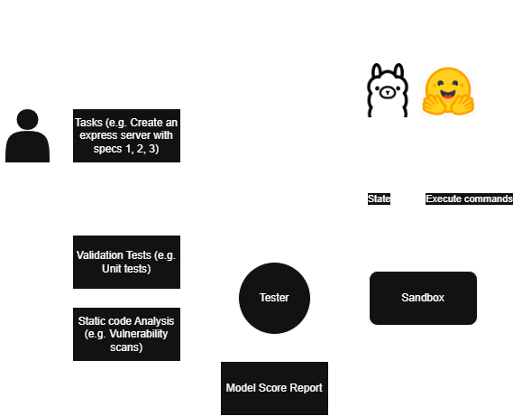

# Agentic Benchmarking System
This system trials and tests models' agentic capabilities by providing models a complete sandbox environment where they can write, run, and read files and code. It could be thought of as a coding agent that has its own environment to execute in.

A journey of this system is as follows:
- The user provides a prompt detailing a project they want (e.g. An express server with /POST login)
- The user provides a test suite (currently newman collections for unit tests)
- The system will provide the tasks to the agent, wait for it to finalize the creation and runs the server.
- The system will execute the tests on the generated server and will score the model based on the results.

## TODO

### Functionality
- ~~**Integration Tests**: Add Integration tests~~ > Done by newman
- **Front-end Tests**: Add front end tests 
- **Centralized score**: Add a scorer to aggregate all test results to rank models

### Quality

- ~~**Seperate MCP Server**: Decouple the MCP server from the agent to be in a container~~
- **Isolate Sandbox**: Air Gap the sandbox so the agents are limited to installing generic packages
- **DinD**: Apply Docker-in-Docker methodology to have sandboxes created by agents using [DinD](https://hub.docker.com/_/docker)
- **Docker Native Sandbox**: Research on using [Docker's own sandbox](https://docs.docker.com/ai/sandboxes/)
